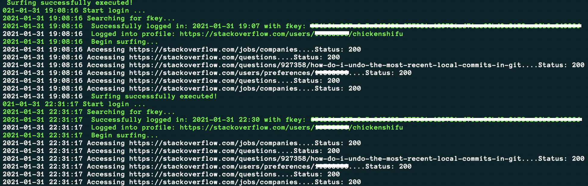

# stackoverflow-login
<b>A short, handy python script to automatically login to stackoverflow.com - perfect with CRON 🕒 </b></br>
What is it good for? You can use it as a boilerplate script to build any other automated stuff on it or just to earn your "Enthuastic" or "Fanatic" badge (30 or 100 consecutive days of visit).





<h2>✅ How to use?</h2>


<ol>

<li>
Set the two environment variables 'SO_USR' and 'SO_PWD' and assign your respective Stackoverflow Username and Password to them. For this, modify the "set_env.sh" appropriately. After doing this, move this shell script to /etc/profile.d/ </li>

<li>
Set a cronjob to whatever time you want the login magic to be happen. E.g., run the script every day at 10:30 pm.
To grant cronjob access to env variables from step 1, you need to define it in the crontab. E.g.: 
</li>
</ol>

```bash
30 22 * * * . /etc/profile.d/; cd path-to-your-script && path-to-your-python-executable && 
./core.py | ts "%F %T" >> path-to-your-script/so_log 2>&1
```


<h2>🤔 Any remarks, comments, bugs, etc.?</h2>
Please feel free to issue pull requests with new ideas or features! :)
